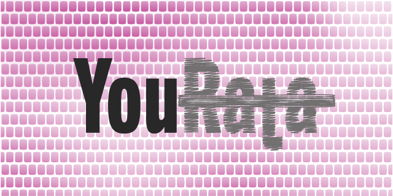
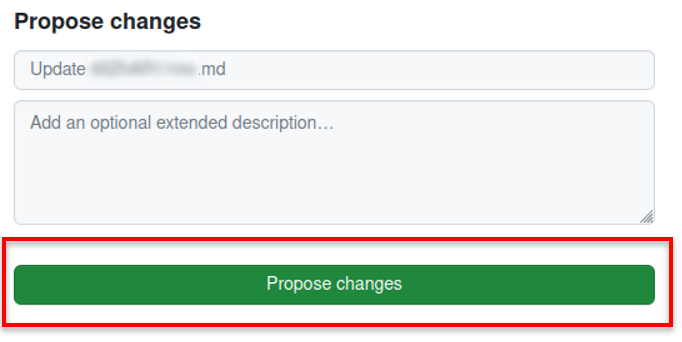
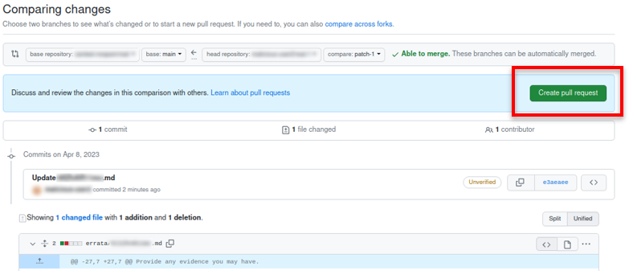
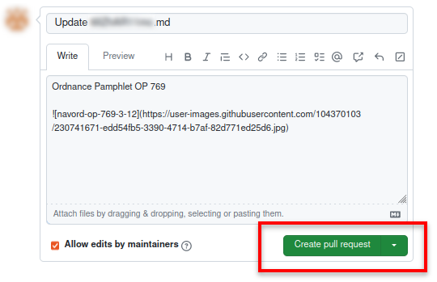

# Purpose

Millions of people rely on the information found in YouTube videos. However, YouTube does not provide any means for the content creators to edit these videos after publishing. Furthermore, there is no formal, evidence-based feedback process for viewers to contact the creators about errors in the content. This perpetuates the spread of false information and limits sources to only what the creator had access to at the time of publishing.

# Learn how to use YouRata

Anyone who finds an error on this YouTube channel can contribute errata. Before submitting errata you must indicate the specific time in the video when the statement was made, what was said, the correct statement, and provide any evidence in the form of references. See [CONTRIBUTING](./CONTRIBUTING.md)

## Quickly submit errata on YouTube

The process of adding errata involves incorporating text into a pre-existing document stored on GitHub. Contributors insert a new line in the appropriate timeframe where the mistake was made.

1. On the YouTube video description, click the link to see errata.  

2. Make sure you're signed in to GitHub.com with your GitHub account.  
3. The corresponding errata file on GitHub opens, where you need to click the **Edit this file** pencil icon.  

4. The errata opens in a time-marked editing page where you can make changes to the file. Enter your correction under the timeslot and include your references. Files in GitHub are written and edited using Markdown language. For help on using Markdown, see [Mastering Markdown](https://guides.github.com/features/mastering-markdown/).  

5. When you're finished making changes, click the green **Propose changes** button.  

6. On the **Comparing changes** page that appears, click the green **Create pull request** button.  

7. On the **Open a pull request** page that appears, provide any evidence in the form of references in the **Leave a comment** field. These can be book titles, visual evidence, witness statements, etc. You can drag and drop file attachments directly to this section.  
  
Click the green **Create pull request** button.  

8. The YouTube content creator will review your changes and if approved, your edits will appear in the errata file.

## Contributing to YouRata

This repository was created from the official [YouRata](https://github.com/battleship-systems/YouRata) template. If you have any suggested modifications to the source code, they should be submitted there.

## License

The source code to YouRata is provided under the [MIT license](https://github.com/battleship-systems/YouRata/blob/main/LICENSE)
